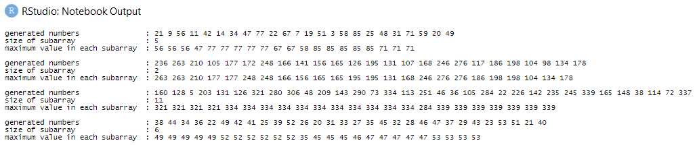

# solution in R

```r
suppressPackageStartupMessages(library(tidyverse))
set.seed(42)
```

## designing the code

## coding

```r
# param:  the minimum value
#         the maximum value
#         the number of generated numbers
#         size of subarray
#
# return: print of maximum values in each subarray
max_of_subarray = function(min, max, n, A) {
  generated = sample(c(min:max), n) # generate n random numbers
  
  hist = c() # initialize empty vector to track maximum values
  index = 1 # initialize first index
  
  while (index <= (length(generated) - A + 1)) {
    value = max(c(generated[index:(index + (A - 1))])) # find maximum value in subarray
    hist = c(hist, value) # merge previously recorded maximum value with a new one
    index = index + 1 # update index value
  }
  
  # output
  cat(c("generated numbers \t\t:", generated, "\n"))
  cat(c("size of subarray \t\t:", A, "\n"))
  cat(c("maximum value in each subarray \t:", hist, "\n\n"))
}
```

For reference, I’ve created test cases.

```r
max_of_subarray(3,90,24,5)
max_of_subarray(94,280,25,2)
max_of_subarray(1,398,33,11)
max_of_subarray(20,53,30,6)
```

And the results were:



[back](./challenge.md)
