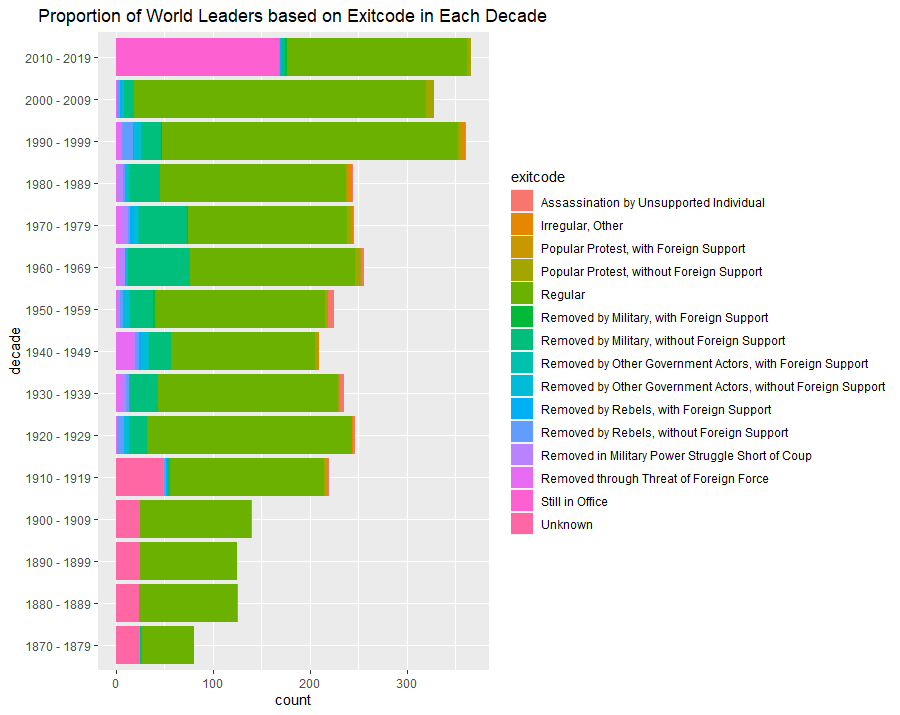

# solution

First step was to import the required libraries. I used ```tidyverse``` as the core package and would be adding more packages along the way as needed.

```r
suppressPackageStartupMessages(library(tidyverse))
```

Next step was to import the downloaded dataset.

```r
dataset <- read_csv("archigos-mar-2016.csv")
```

There was an error with `borndate` variable for observation `#1417` which belonged to Didier Burkhalter but it was neglible.

The challenge describes a variable named `endyear` for the plot's x-axis which doesn't exist, so I did a little data manipulation to extract the `endyear`. I type-casted the `enddate` variable to _Date_ data type before using `substring()` to extract only the end year which then I added into the dataset. Since there had been a lot of years to plot, I chose to group them into decades (i.e. 1870 - 1879, 1880 - 1889, etc.) to make the x-axis easier to read, and then flipped the coordinates based on the principle of good data visualization.

```r
dataset$enddate <- as.Date(dataset$enddate)

dataset <- dataset %>% mutate(
  endyear = substring(enddate, 1, 4),
  decade = as.factor(as.numeric(endyear) - (as.numeric(endyear) %% 10))
)

dataset$decade <- factor(dataset$decade,
                         levels = seq(from = 1870,
                                      to = 2010,
                                      by = 10),
                         labels = c("1870 - 1979",
                                    "1880 - 1889",
                                    "1890 - 1899",
                                    "1900 - 1909",
                                    "1910 - 1919",
                                    "1920 - 1929",
                                    "1930 - 1939",
                                    "1940 - 1949",
                                    "1950 - 1959",
                                    "1960 - 1969",
                                    "1970 - 1979",
                                    "1980 - 1989",
                                    "1990 - 1999",
                                    "2000 - 2009",
                                    "2010 - 2019"))
```

Finally, I made a stacked barplot which shows the proportion of exits in each decade.

```r
ggplot(data = dataset) +
  geom_bar(mapping = aes(x = decade, fill = exitcode),
           position = "stack") +
  labs(title = "Proportion of World Leaders based on Exitcode in Each Decade") +
  theme(plot.title = element_text(hjust = 0.5)) +
  coord_flip()
```



#### references

[substring()](http://rfunction.com/archives/1692) <br>
[Binning years to decades](https://stackoverflow.com/questions/35352914/floor-a-year-to-the-decade-in-r)

[back](./challenge.md)
