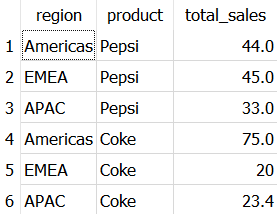

# solution in SQL

I used `sqlite3` to code the solution and used Window's Command Prompt as my IDE.

## create tables

### product_pricing

```sql
create table product_pricing (
	region varchar(20),
	product varchar(20),
	price numeric(4,2),
	foreign key (region) references product_sales on delete cascade
);
```

### product_sales

```sql
create table product_sales (
	region varchar(20),
	product varchar(20),
	num_sales numeric(4,0)
);
```

## load contents

### product_pricing

```sql
INSERT INTO product_pricing VALUES ('Americas','Pepsi','2.2');
INSERT INTO product_pricing VALUES ('EMEA','Pepsi','1.8');
INSERT INTO product_pricing VALUES ('APAC','Pepsi','1.5');
INSERT INTO product_pricing VALUES ('Americas','Coke','2.5');
INSERT INTO product_pricing VALUES ('EMEA','Coke','2.0');
INSERT INTO product_pricing VALUES ('APAC','Coke','1.8');
```

### product_sales

```sql
INSERT INTO product_sales VALUES ('Americas','Pepsi','20');
INSERT INTO product_sales VALUES ('EMEA','Pepsi','25');
INSERT INTO product_sales VALUES ('APAC','Pepsi','22');
INSERT INTO product_sales VALUES ('Americas','Coke','30');
INSERT INTO product_sales VALUES ('EMEA','Coke','10');
INSERT INTO product_sales VALUES ('APAC','Coke','13');
```

## querying

```sql
SELECT region, product, (num_sales*price) as total_sales
FROM product_sales NATURAL JOIN product_pricing;
```

I ran the query in **DB Browser for SQLite** which resulted in the desired output.



[back](./challenge.md)
