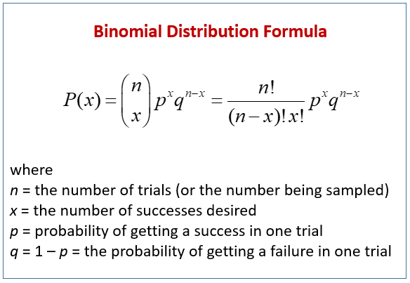

# solution

The wording was a bit unusual to me, but I believed that the point of the challenge was to find the probability of the company having to replace the package; two or more gaskets would have to be defective. 

I defined a few things from the given information:

- The number of trials  is 20. That would be the number of gaskets in a box.
- The probability of failure defined as when gasket would be defective,  is .
- The probability of success defined as when gasket would be functional, .
- The desired "success" defined as the replacement of a whole box, &space;=&space;1&space;-&space;P(x&space;<&space;2)).

Plugging in the numbers and I'd get:

&space;=&space;1&space;-&space;P(x&space;<&space;2))
&space;=&space;1&space;-&space;P(x&space;=&space;0)&space;-&space;P(x&space;=&space;1))

[back](./challenge.md)
