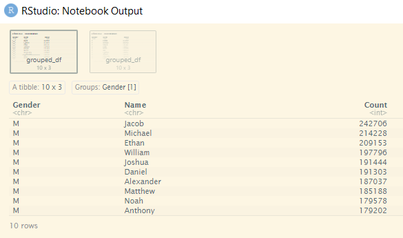
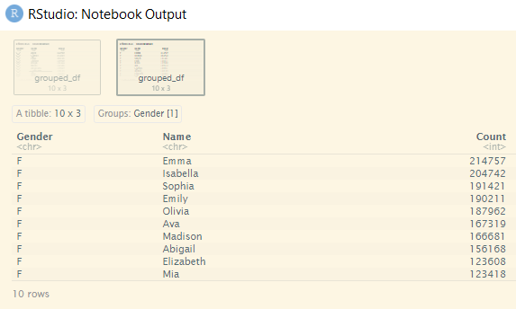

# solution in R

## importing packages and pre-processing data

First step was to import the required libraries. I used `tidyverse` as the core package and would be adding more packages along the way as needed.

```r
suppressPackageStartupMessages(library(tidyverse))
```

Next step was to import the dataset. The `Gender` column had to be type-casted into *character* during import. The column had been read as *logical* due to the **F** by default stands for **FALSE** instead of **Female**. Thus, the `read.csv()` threw an error once **M** was read in because it was expecting **T** for **TRUE**, not **M** for **Male**. There had been an uneeded column that was removed which was the duplicate of `Id` under the default name of `X`.

```r
dataset <-
  read.csv(
    "https://raw.githubusercontent.com/guipsamora/pandas_exercises/master/06_Stats/US_Baby_Names/US_Baby_Names_right.csv",
    colClasses = c("Gender" = "character")
  ) %>%
  select(-X)
```

## data aggregation

Next was data aggregation which was saved under the name `tally`.

```r
tally <- dataset %>%
  group_by(Gender, Name) %>% # group by gender and name
  summarise(Count = sum(Count)) %>% # sum all the counts for each name
  arrange(desc(Count)) # sort the name starting with the highest count
```

## displaying result

Finally to show the top ten name for male and female babies.

```r
head(tally %>% filter(Gender == "M"), 10)
head(tally %>% filter(Gender == "F"), 10)
```

Here was the screenshotted result.

 <br>


[back](./challenge.md)
