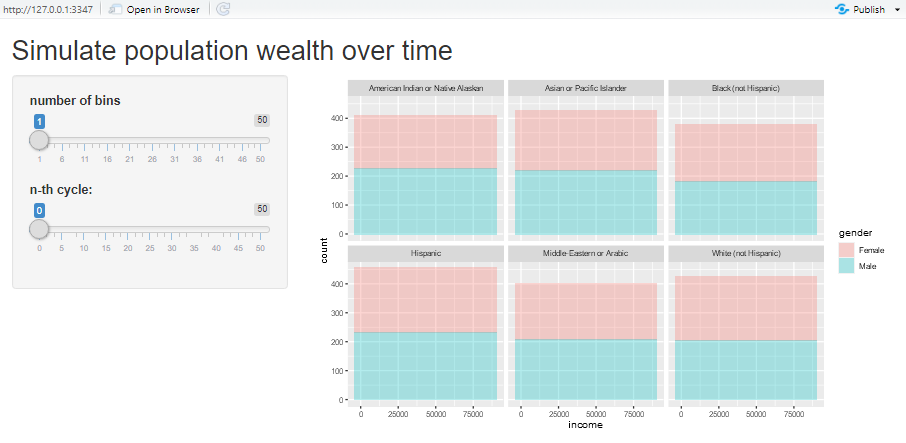
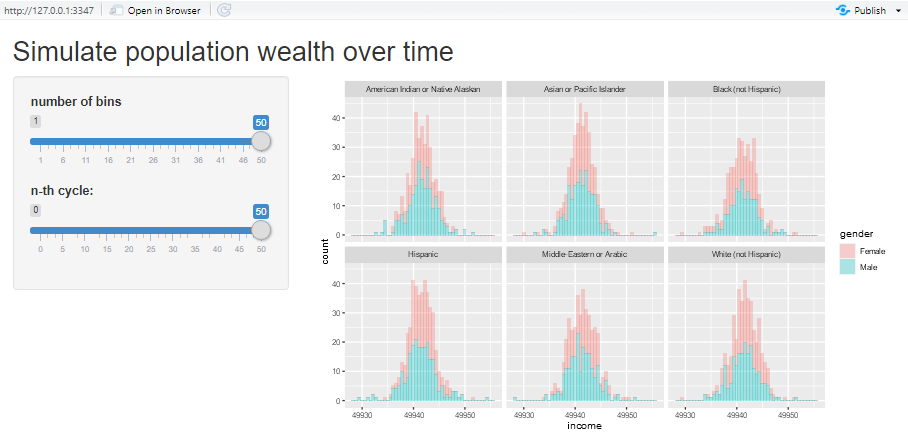

# solution in R

### create population and its wealth

First step was to import the required libraries. I used `tidyverse` as the core package and would be adding more packages along the way as needed.

```r
suppressPackageStartupMessages(library(tidyverse))
```

The challenge doesn't come with a dataset so I made one on my own under the name `pop` dataset. The characteristics of the population would include **gender**, **ethnicity**, **first_name**, **last_name** and **income**. To create the data for the first four columns, I used `randomNames` package and set some arbitary number for the random generator so that the code would be reproducible. Then, call the `randomNames()` to generate 2500 observations and save it to `pop` variable.

```r
suppressPackageStartupMessages(library(randomNames))
set.seed(42)
pop <- randomNames(2500, return.complete.data = T)
```

The **income** column would be randomly generated using `rnorm()` while keeping the specifications in mind; the population income is Normal distributed with mean of USD 50,000 and standard deviation of USD 12,500. I added the `income` column into `pop` dataset using `mutate()` where it'd be the very last column.

```r
pop <- pop %>% mutate(
  income = rnorm(2500, 50000, 12500))
```

When viewing `pop` dataset, notice that `gender` and `enthicity` column had been coded in numerics based on the [`randomNames` documentation's specification](https://cran.r-project.org/web/packages/randomNames/randomNames.pdf). For the purpose of later visualization, the numerics needed to be decoded into categorical variables as follows:

-`gender`
  - **0** = **Male**
  - **1** = **Female**
 
 -`ethnicity`
  - **1** = **American Indian or Native Alaskan**
  - **2** = **Asian or Pacific Islander**
  - **3** = **Black (not Hispanic)**
  - **4** = **Hispanic**
  - **5** = **Black (not Hispanic)**
  - **6** = **Middle-Eastern, Arabic**

The `factor()` can bind those numerics into its corresponding factor.

```r
pop$gender <- factor(pop$gender,
                     levels = c(0,1),
                     labels = c("Male", "Female"))

pop$ethnicity <- factor(pop$ethnicity,
                        levels = c(1:6),
                        labels = c("American Indian or Native Alaskan",
                                   "Asian or Pacific Islander",
                                   "Black (not Hispanic)",
                                   "Hispanic",
                                   "White (not Hispanic)",
                                   "Middle-Eastern or Arabic"))
```

The data had been fully processed.

### simulation

I hadn't known any package that's used specifically for simulation of wealth distribution so I decided to design one. I tried to make the decision making as random as possible. For the purpose of data visualization, I had initialized `hist` which was historical dataframe to record changes in income that happened during simulation. I also labeled each step of simulation under the variable `cycle`.

```r
hist <- pop %>% mutate(
  cycle = 0 # initialize original population
)

for (i in 1:50){ # simulate 50 transactions
  
  # pair up random people to perform transaction
  pairs = sample(1:1250, 1) # pick one number to represent number of pairs of people
  a = sample(1:2500, pairs, replace = FALSE) # pick the first halves of the pair from pool of 2500 people
  b = sample(c(1:2500)[-a], pairs, replace = FALSE) # pick the second halves of the pair from the remaining people
  
  # calculate new income and assign the splits to pairs
  new_income = (pop$income[a] + pop$income[b])/2 # add pairs' income and split by two
  pop$income[a] = new_income # assign resulting income to first halves of the pair
  pop$income[b] = new_income # assign resulting income to second halves of the pair
  
  pop <- pop %>% mutate(
    cycle = i # capture population at n-th cycle
  )
  
  hist <- rbind(hist, pop) # bind accumulated historical data with new one
}
```

I exported the dataset into .csv for data visualization under tthe name `hist.csv`.

### visualization

To visualize the exported dataset, I used <a href = "https://docs.rstudio.com/shinyapps.io/" target = "_blank">shinyapps.io</a>. The code is divided into two, `server` and `ui`.

#### server

```r
# import packages
suppressPackageStartupMessages(library(shiny))
suppressPackageStartupMessages(library(tidyverse))

# import dataset
dataset <- read.csv("hist.csv")

shinyServer(function(input, output) {
    output$incomePlot <- renderPlot({
        filtered <- filter(dataset, cycle == input$selected) # filter dataset based on cycle (slider input)
        
        # build the histogram
        ggplot(data = filtered) + # use filtered data
            geom_histogram(mapping = aes(x = income, fill = gender), # create income histogram filled by gender
                         alpha = 0.3, bins = input$bins) + # modify transparency and number of bins (slider input)
            facet_wrap( ~ ethnicity) # facet the histogram based on ethnicity
    })
})
```

#### ui

```r
# import packages
suppressPackageStartupMessages(library(shiny))

shinyUI(fluidPage(
    titlePanel("Simulate population wealth over time"),
    
    sidebarLayout(sidebarPanel(
        
        sliderInput( # slider bar to control number of histogram bins
            "bins",
            "number of bins",
            min = 1,
            max = 50,
            value = 1
        ),
        
        sliderInput( # slider bar to select n-th cycle
            "selected",
            "n-th cycle:",
            min = 0,
            max = 50,
            value = 0
        )
    ),
    
    
    mainPanel(plotOutput("incomePlot")))
))
```

The user interface of the shinyapp looks like the picture below. The interactive histograms on the right shows distribution in income between two genders across six ethnicities. The two sliders give users freedom to choose the number of histogram bins and n-th transaction out of fifty that were simulated.



I observed the resulting histograms to notice that there was a pattern in population income. At the end of simulation, the average income between two genders in each etnicity is converged to around $49,000 with small variance in values. The first significant convergence was already shown halfway through the simulation cycle.



#### references

[`randomNames()`](https://cran.r-project.org/web/packages/randomNames/randomNames.pdf) <br>
[`factor()`](https://www.statmethods.net/input/valuelabels.html)

[back](./challenge.md)
