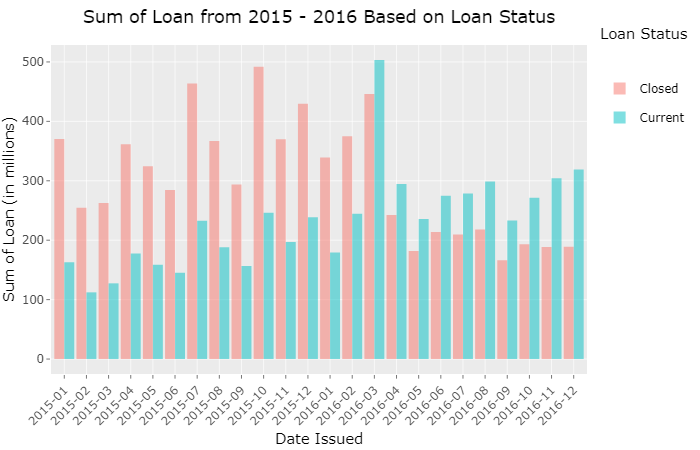

# Solution in R

### Pre-processing Data

First, import the required libraries. Use `tidyverse` as the core package and add more packages along the way as needed, but it's very unlikely for daily data analyses. I chose to suppress the [diagnostic messages](https://www.rdocumentation.org/packages/base/versions/3.6.2/topics/message), hence the `suppressPackageStartupMessages()`. Loading the library without the suppression, `library(tidyverse)`, works as well.

```r
suppressPackageStartupMessages(library(tidyverse))
```

Next, import the CSV file using `read.csv()`. After every import, **always** check if the file is imported correctly (i.e. no parsing error, correct column name(s), correct data type(s), each variable has its own column, each observation has its own cell).

There was a parsing error in the `desc` variable when importing and saving the file into the `dataset` variable; 40 rows had characters in them though `desc` was specified as _numeric_. Further description to an error while reading a file can be checked using `problems()`. To fix the error, I utilized the `colClasses()` parameter by defining `desc` column as _character_. It wouldn't have any significant effect to how I'd process the data seeing that the _numeric_ values were only zeroes. It'd also be logical to change the column's data type since "desc" is short for "description". `read_csv()` doesn't have `colClasses()` parameter though I'd imagine it'd load this large dataset faster.

```r
dataset <- read.csv("trunc_loan_data.csv",
                    colClasses= c("desc" = "character"))
```

After the file is read properly, next is to check for more errors. The `str()` gives "structure" of the desired object. If applied towards a name of a dataset, it gives descriptions about a dataset's column name(s) and column type(s).

```r
str(dataset)
```

The imported file was missing a column name. The first column was supposed to be `zip_code` but it didn't exist in the original file. R naturally replaces the missing column name with `X` or `X1`, with the number signifiying the n-th missing column name. To rename a column name, or multiple column names, use `colnames()`. Since I had a _specific_ column that _I knew the location of_ in the dataset, I could specify its location  using `[]` so that the name change would be applied _directly to that column only_. If I had had typed `colnames(dataset)` which hadn't specified the column I wanted, then `colnames()` would require the remaining column names after `zip_code`.

```r
colnames(dataset)[1] <- c("zip_code")
```

I noticed that some columns didn't have its correct data type, particularly columns that were supposed to be _Date_ objects such as: `earliest_cr_line`, `issued_d`, `last_credit_pull_d`, `last_pymnt_d` and `next_pymnt_d`. I used `parse_time_date()` as opposed to `as.Date()` ~~because I coulnd't get the function working properly on my laptop~~ to type cast these columns from _character_ to _Date_.

```r
dataset$earliest_cr_line <- parse_date_time(dataset$earliest_cr_line, orders = c("my", "ym"))
dataset$issue_d <- parse_date_time(dataset$issue_d, orders = c("my", "ym"))
dataset$last_credit_pull_d <- parse_date_time(dataset$last_credit_pull_d, orders = c("my", "ym"))
dataset$last_pymnt_d <- parse_date_time(dataset$last_pymnt_d, orders = c("my", "ym"))
dataset$next_pymnt_d <- parse_date_time(dataset$next_pymnt_d, orders = c("my", "ym"))
```

There would be parsing errors caused by singular zeroes which `parse_date_time()` doesn't recognize as date format. Those were cases which a loan hadn't been issued for reasons unknown, no payment had been made, or no credit had been pulled. The parsing error causes `NA` to exist in the dataset but that's okay.

Now, the format of those Date columns is `yyyy-mm-dd UTC` which is _slightly_ incorrect. Technically, there's no day specified in the original file, only abbreviated month and year without century. There's also the "UTC" set by `parse_date_time()` automatically seeing that I don't specify which timezone those dates are in. Thus, string manipulation is needed to extract only the year and month. In this case, I'm using `sub()` to get rid of anything after the second hypen.

```r
dataset$earliest_cr_line <- sub("^([^-]*-[^-]*).*", "\\1", dataset$earliest_cr_line)
dataset$issue_d <- sub("^([^-]*-[^-]*).*", "\\1", dataset$issue_d)
dataset$last_credit_pull_d <- sub("^([^-]*-[^-]*).*", "\\1", dataset$last_credit_pull_d)
dataset$last_pymnt_d <- sub("^([^-]*-[^-]*).*", "\\1", dataset$last_pymnt_d)
dataset$next_pymnt_d <- sub("^([^-]*-[^-]*).*", "\\1", dataset$next_pymnt_d)
```

Now that the data has been processed, I can start playing with the data.

### Data Manipulation

First, create a `loan_status_type` column by categorizing `loan_status` into "Closed" or "Current". The `loan_status_type` has six statuses which are **Fully Paid**, **Current**, [**Charged Off**](https://en.wikipedia.org/wiki/Charge-off), **Late (16 - 30 days)**, **Late (31 - 120 days)**, **In Grace Period** and [**Default**](https://www.investopedia.com/terms/d/default2.asp). In this case, **Fully Paid** is categorized as **Closed** while other categories are considered **Current**. By combining functionalities of `mutate()` and `if_else()`, the newly created `loan_status_type_` will be the last column added into the `dataset` variable.

```r
dataset <- dataset %>% mutate(
  loan_status_type = if_else(loan_status == "Fully Paid",
                             "Closed",
                             "Current"))
```

Next, create a `loan_status_standing` column by categorizing `loan_status` into "Good" or "Bad" customers. In this case, **Fully Paid** is categoized as **Good** while other categories are considered **Bad**. Create `loan_status_standing` using the same method in the previous code chuck.

```r
dataset <- dataset %>% mutate(
  loan_status_standing = if_else(loan_status == "Fully Paid",
                             "Good",
                             "Bad"))
```

Finally, plotting month and year the loan was issued and the sum of the loan amounts by loan_status_type. The challenge seems to have entered incorrect information as the dataset doesn't have `loan_status_contract` nor is there any description of what the column is, should I create one. The column `issue_d` shows when the loan was funded and the 
column `loan_amnt` shows the amount of the loan applied for by the borrower and any deduction made by the credit department. I need to do some data aggregation to calculate the sum of loan, and save the result into a dataframe which will be used for plotting.

```r
sum_loan_amnts <- dataset %>%
  group_by(issue_d, loan_status_type) %>%
  summarize(sum = sum(loan_amnt))
```

In this challenge, the appropriate plot to show the sum of loan every month between 2015 and 2016 is barplot. Because the sum is too large in number to be displayed properly, I'll be using `plotly` package to make the barplot interactable so the monthly sum will pop once the mouse hovers over the bar. Thus, I need to add another package into the script.

```r
suppressPackageStartupMessages(library(plotly))
```

The barplot is designed to be vertical because it has ordinal variable involved which is `issue_d`. The viewer will read the plot from left to right in chronological order from January 2015 to December 2016. The **sum** variable's values are scaled down by 10<sup>^6</sup> to ease reading; the detailed values can be viewed when the mouse hovers each bar using `ggplotly()`. The bars have been colored based on loan status, **Current** or **Closed**, because it's an important feature in this dataset. The bar of each loan status type is positioned side-to-side to show comparison in sum of loan in a month quickly. The purpose of minimalizing the display is to give general information _in a glance_. Addiding meaningful plot title, x-axis label and y-axis label helps too.

```r
p <- ggplot(data = sum_loan_amnts) +
  geom_col(mapping = aes(x = issue_d,
                         y = sum/10^6,
                         fill = loan_status_type),
           position = "dodge",
           alpha = 0.5) +
  labs(title = "Sum of Loan Monthly from 2015 - 2016 Based on Loan Status",
       x = "Date Issued",
       y = "Amount of Loan (in millions)",
       fill = "Loan Status") +
  theme(plot.title = element_text(hjust = 0.5),
        axis.text.x = element_text(angle = 45, hjust = 1))

ggplotly(p)
```

This is what the static plot looks like. The interactable plot works only in browser or programming IDE.



The plot describes the sum of loan based on date issued and loan status type from January 2015 to December 2016.

#### References

[`sub()`](https://stackoverflow.com/questions/41622326/remove-all-characters-after-the-3rd-occurrence-of-in-each-element-of-a-vecto) <br>
[`parse_date_time()`](https://lubridate.tidyverse.org/reference/parse_date_time.html)

[back](challenge.md)
