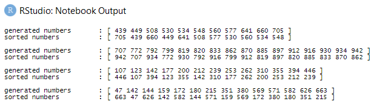

# solution in R

## designing the code

My solution was to cross off numbers from both ends of an ascendingly sorted numbers. The challenge comes with an example:

```
generated = [10, 2, 11, 3, 7, 4, 1]
```

There're seven random numbers. When sorted ascendingly, the list becomes:

```
asc_sorted = [1, 2, 3, 4, 7, 10, 11]
```

I'd need two pointers to traverse the sorted numbers, one on each end of the list; **head** and **tail** according its starting position. **Tail** would traverse its first number, **11**, followed by **head** crossing off **1** of the list. The first look of the alternately sorted list would look like:

```
alter_sorted = [11, 1]
```

**Head** and **tail** would each take another step to cross off another number. **Tail** would cross off **10** and **head** would cross off **2**. The `alter_sorted` would get updated into:

```
alter_sorted = [11, 1, 10, 2]
```

**Head** and **tail** would each take another step to cross off another number. **Tail** would cross off **7** and **head** would cross off **3**. The `alter_sorted` would get updated into:

```
alter_sorted = [11, 1, 10, 2, 7, 3]
```

So far `alter_sorted` had had six of the seven randomly generated numbers. Only one number is left to cross off the list, **4**, but I had had two pointers. Thus, there should be a separate precaution in the code later on that if the number of generated numbers is odd, just pop the last number into `alter_sorted`. Thus, the final look would be:

```
alter_sorted = [11, 1, 10, 2, 7, 3, 4]
```

If the number of generated numbers is even, then there would be no problem at all. In that case, it would've stopped at **3**, each pointer would've crossed off three numbers. Traversing odd-numbered list would've meant that one pointer would be left without an item, which would cause an error in programming.

## coding

First step was to import the required libraries. I used `tidyverse` as the core package and would be adding more packages along the way as needed. I set an arbitrary number as seed for the random number generator so the code may be reproducible.

```r
suppressPackageStartupMessages(library(tidyverse))
set.seed(42)
```

Next, I defined a function to sort randomly generated numbers alternately between great and small numbers based on the observation which I named `alter_sort`.

```r
# param:  the minimum value
#         the maximum value
#         the number of generated numbers
#
# return: print of generated values
#         print of sorted values
alter_sort = function(min,max,n){
  generated = sort(sample(c(min:max),n))
  
  front = 1 # index counting forward
  back = length(generated) # index counting backward
  
  sorted = c() # initialize empty vector
  while(front < back){
    sorted = c(sorted,generated[back],generated[front]) # merge previous vector with sorted values
    
    # updating index value
    front = front + 1
    back = back - 1
  }
  
  if(n%%2 != 0){
    sorted = c(sorted,generated[back])
  }
  
  cat(c("generated numbers \t:","[",generated,"]\n"))
  cat(c("sorted numbers \t\t:","[",sorted,"]","\n\n"))
}
```

For reference, I've created test cases.

```r
alter_sort(405,770,11)
alter_sort(698,945,36)
alter_sort(40,517,13)
alter_sort(40,669,18)
```

And the results were:


